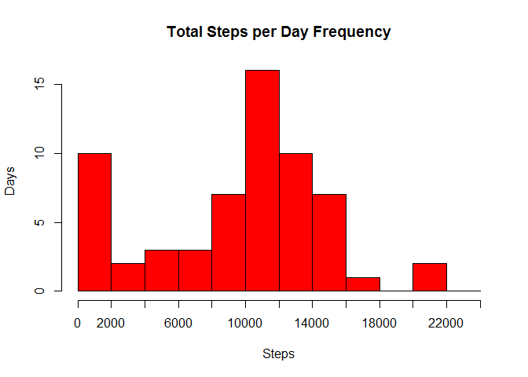
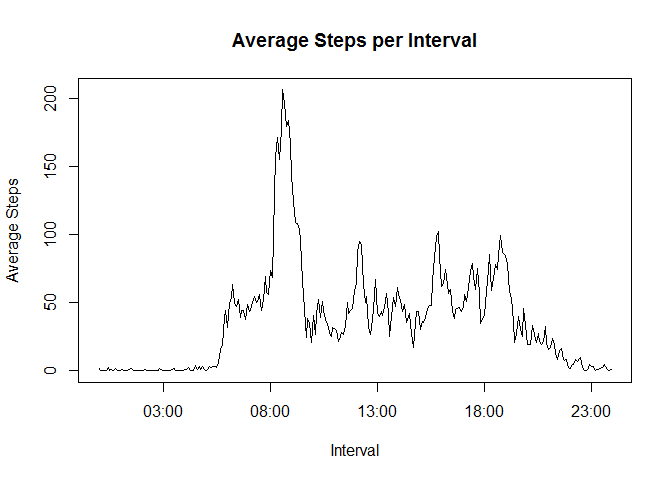
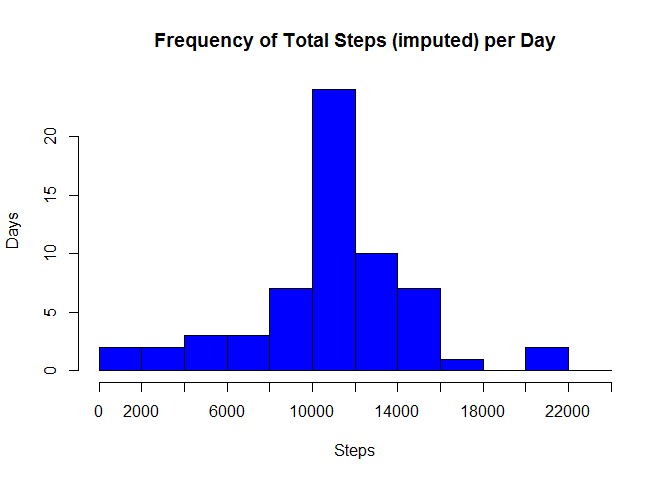
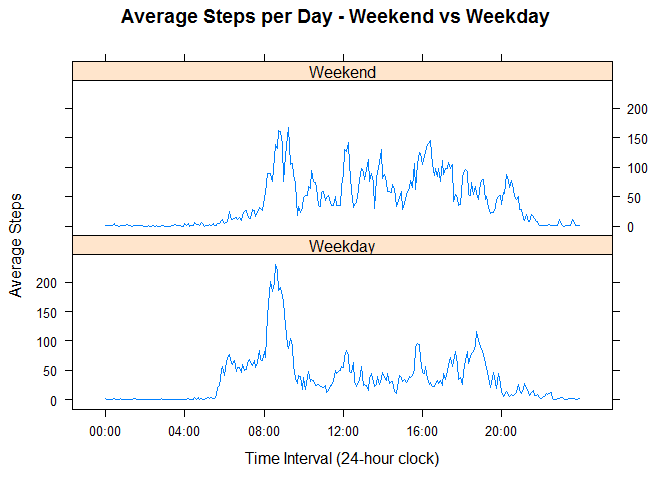

# Reproducible Research: Peer Assessment 1


## Loading the data


```r
library(lattice)
library(knitr)
opts_chunk$set(echo=TRUE,results="show",cache=TRUE)
setwd('C:/Users/mlandry/Documents/GitHub/ReproducibleResearch/RepData_PeerAssessment1')

Master <- read.table("activity.csv",
                     header=TRUE,
                     sep=",",
                     stringsAsFactors = FALSE,
                     colClasses = c("numeric","Date","numeric")
)
df <- Master
```

#Generate Histogram of total steps per day

\

#Calculate mean and median steps per day


```r
stepMean <- mean(TotalStepsByDay$x,na.rm=T)
print(paste("PART 1: The Mean number of steps per day is",round(stepMean,1)))
```

```
## [1] "PART 1: The Mean number of steps per day is 9354.2"
```

```r
stepMedian <- median(TotalStepsByDay$x,na.rm=T)
print(paste("PART 1: The Median number of steps per day is",round(stepMedian,1)))
```

```
## [1] "PART 1: The Median number of steps per day is 10395"
```

#Process data by converting time to something usable for this exercise, format adding 0's where needed


```r
intHours <- df$interval %/% 100
intHours <- ifelse(intHours < 10,paste("0",intHours,sep=""),intHours)
intMinutes <- df$interval %% 100
intMinutes <- ifelse(intMinutes < 10,paste("0",intMinutes,sep=""),intMinutes)

intTime <- paste(intHours,":",intMinutes,sep="")
intTime <- strptime(intTime,format="%H:%M")
df <- cbind(df,intTime)
```

#Start plotting the time

\

#Which interval has the highest average?


```r
MaxStepAvg <- max(SPI$x)
IntervalWithMaxStepAvg <- SPI$intTime[SPI$x == MaxStepAvg]
print(paste("PART 2: The highest average is", MaxStepAvg))
```

```
## [1] "PART 2: The highest average is 206.169811320755"
```

```r
print(paste("PART 2: at this time", IntervalWithMaxStepAvg))
```

```
## [1] "PART 2: at this time 2016-01-09 08:35:00"
```

#Deal with missing values


```r
countNAs <- sum(is.na(df$steps))
print(paste("PART 2: Number of missing values =", countNAs))
```

```
## [1] "PART 2: Number of missing values = 2304"
```

#Fill in missing values


```r
names(SPI)[names(SPI)=="x"] <- "avgIntervalSteps"
dfWithAvg <- merge(x=df,y=SPI,by="intTime",all.x=TRUE)
dfWithAvg <- dfWithAvg[order(dfWithAvg$date,dfWithAvg$intTime),]
dfWithAvg$imputedSteps <- ifelse(is.na(dfWithAvg$steps), 
                                 dfWithAvg$avgIntervalSteps,
                                 dfWithAvg$steps)
```

#Plot total # of steps per day


```r
TotalStepsByDayImputed <- aggregate(dfWithAvg$imputedSteps,list(date=dfWithAvg$date),sum,na.rm=TRUE)
xAxis = seq(from=0,to=25000,by=2000) 
hist(TotalStepsByDayImputed$x,
     breaks = xAxis,
     main="Frequency of Total Steps (imputed) per Day",
     col="blue",
     xlab="Steps",
     ylab="Days",
     xaxt="n")
axis(side=1,at=xAxis,labels=xAxis)
```

\

#Calculate mean and median steps per day


```r
stepMeanImputed <- mean(TotalStepsByDayImputed$x,na.rm=T)
stepMedianImputed <- median(TotalStepsByDayImputed$x,na.rm=T)
print(paste("PART 3: The Mean number of steps per day is",round(stepMeanImputed,1)))
```

```
## [1] "PART 3: The Mean number of steps per day is 9354.2"
```

```r
print(paste("PART 3: The Median number of steps per day is",round(stepMedianImputed,1)))
```

```
## [1] "PART 3: The Median number of steps per day is 10395"
```

#Calculate new factors for weekday vs weekends


```r
dfWithAvg$weekday <- weekdays(dfWithAvg$date)
dfWithAvg$weekendFlag <- ifelse(dfWithAvg$weekday=="Saturday" | dfWithAvg$weekday=="Sunday","Weekend","Weekday")

#Find the average steps per day for weekend and weekdays
SPI2 <- aggregate(dfWithAvg$imputedSteps,list(intTime=dfWithAvg$intTime,weekendFlag=dfWithAvg$weekendFlag),mean,na.rm=TRUE)

#Align data for plot
xn <- seq(min(dfWithAvg$intTime),max(dfWithAvg$intTime),by="4 hour")
```

#Make a panel plot with the time series data for the weekday vs weekend

\
