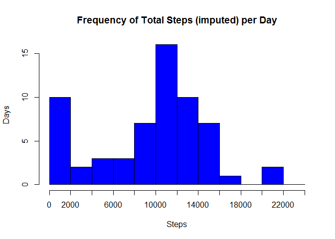

# Reproducible Research: Peer Assessment 1

## Loading the data

#Generate Histogram of total steps per day

\

#Calculate mean and median steps per day

#Process data by converting time to something usable for this exercise, format adding 0's where needed

#Start plotting the time

\

#Which interval has the highest average?

#Deal with missing values

#Fill in missing values

#Plot total # of steps per day

\

#Calculate mean and median steps per day

#Calculate new factors for weekday vs weekend

#Make a panel plot with the time series data for the weekday vs weekend

\
